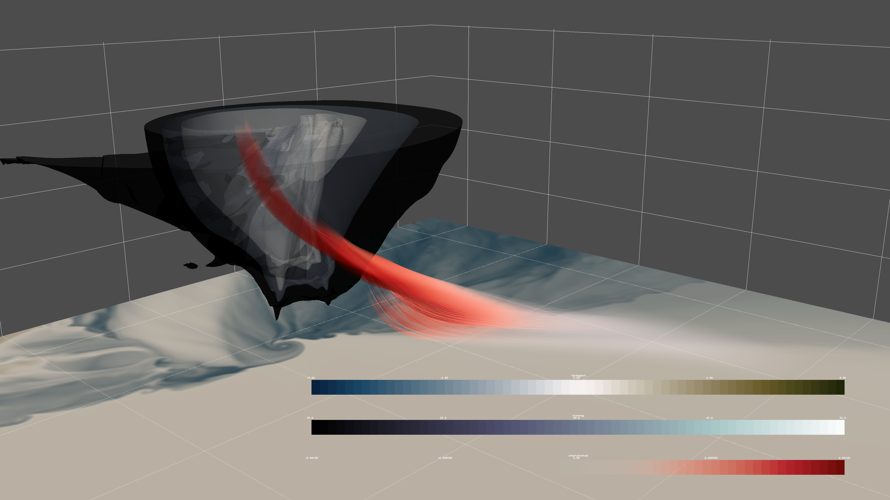
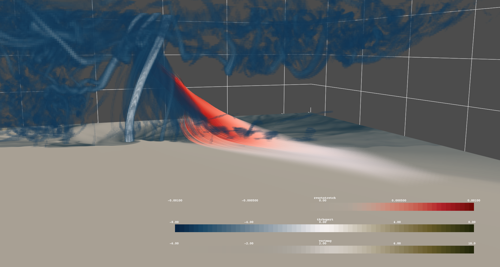

# CM1 Tornado Data from Orf Research Group
## Data is not intended for redistribution outside of this demo of PyVista.

Here is a demo of how to use PyVista to visualize some data in netCDF files!
Can easily be modified to use `xarray` instead.

## NOTE: There are a few known volume render bugs
There are a few known bugs with the volume renderer when it comes to volumes and meshes with opacity. More information can be found here if you wish to follow the issue: https://github.com/pyvista/pyvista/issues/430

Requires:

- `vtk=8.2.0`, `pyvista`, `netCDF4`, and `tqdm`
- install `colorcet` for the `"CET_D1A"` colormap!
- install `cmocean` for the `"diff"` colormap!

Then open up the Jupyter notebook to get something like the following. FYI: change the `notebook=True` arguments for the `Plotter` class to `False` to have a pop-out, interactive scene.

## NOTE: If git LFS isn't letting you download the data, I've uploaded a tarball that can be dowloaded [here](https://drive.google.com/file/d/1BNBEC21WoaNB5WA40wewDZkhUVm7tkRF/view?usp=sharing)

